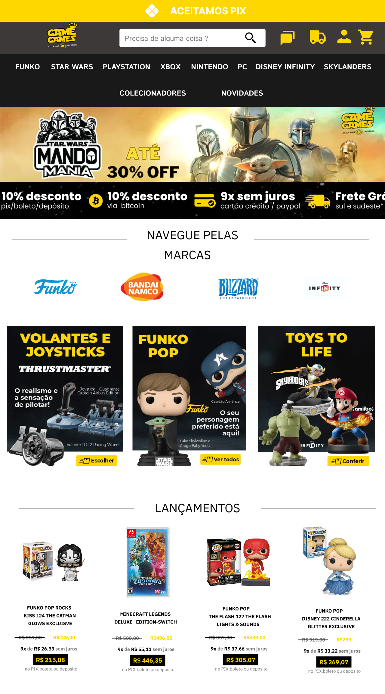
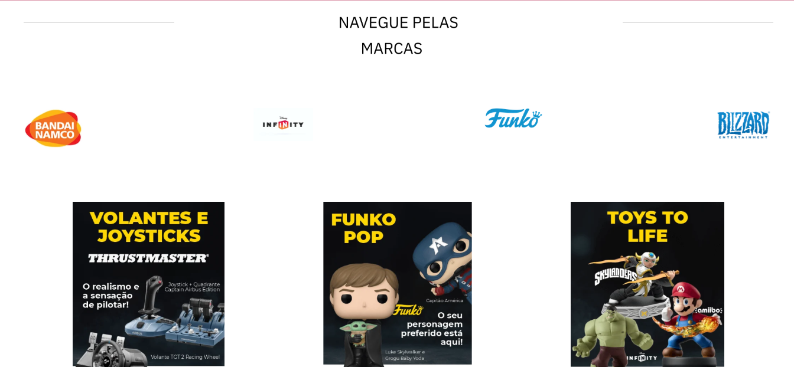
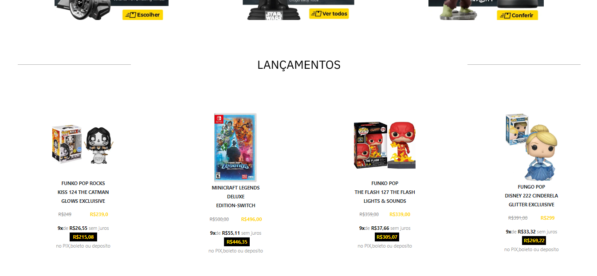

# Projeto de conclusão do curso de Figma

Replica do site [Game Games](https://www.gamegames.com.br/).

## Tecnologias usadas 

- [x] React
- [x] styled Components

### `Figma`

[Projeto](https://www.figma.com/file/8tMvtqbwbZJ62tP55Tqrgs/SITE-GAMER?node-id=1%3A2&t=Iu1kiexStLUusr8B-1)

### `Site`

